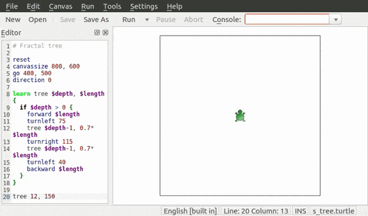

KTurtle is an educational programming environment that uses TurtleSpeak, a programming language loosely based on and inspired by [LOGO](http://en.wikipedia.org/wiki/Logo_programming_language).

The goal of KTurtle is to make programming as easy and accessible as possible. This makes KTurtle suitable for teaching young students the basics of math, geometry and... programming.

## Features

Some of the main features of KTurtle include:
* the ability to translate the programming commands into the native language of the student using the KDE translation framework.
* all you need integrated in in one application.
* simplified programming terminology.
* intuitive syntax highlighting and error markers.

Learn more in the [KTurtle manifesto](MANIFESTO.md).